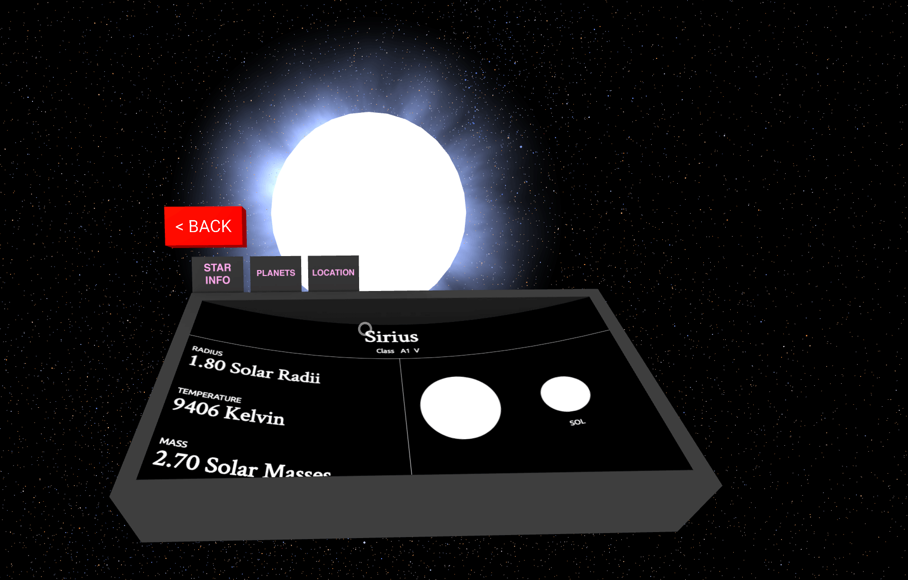

# Up There - WebVR edition



Up There is a three-dimensional VR planetarium, which contains true 3D positions of over 100k nearby stars. You can fly through them at warp speeds, and each star rendered with proportional scaling and coloring based on its magnitude (apparent) and surface temperature.

## How To Try It Now

### GearVR
Install the [Carmel browser](https://www.oculus.com/experiences/gear-vr/1290985657630933/), and then click the GearVR link on the [Up There website](http://uptherevr.com/). It should prompt you to insert your phone into the GearVR, and then the app will load. Use the controls on the side of your headset to move forward and back, interact with switches, or scroll forward and backward in time.

### Cardboard
Open the [Up There site](http://uptherevr.com/) in Chrome and hit the goggles icon in the bottom right, and then place the phone in your Cardboard compatible headset. A bluetooth gamepad is required for control. No time controls currently enabled.

### Desktop (limited support)
If you're using an Oculus or Vive, get a copy of Firefox Nightly or Chromium that has WebVR enabled and visit [the website](http://uptherevr.com/). Limited controller support currently but many possibilities in the future.

## Development

### Installation

```
npm install
```

### Local dev server

```
npm start
```

Then, load [`http://localhost:8080`](http://localhost:8080) in your browser.

### Building Documentation

```
npm run docs
```

Note: docs are *INCOMPLETE* at the moment, I'm chipping away at them when I can. They're being generated with [docco](https://github.com/jashkenas/docco).


### Origins in A-Painter

I forked the wonderful [A-Painter](https://blog.mozvr.com/a-painter/) from Mozilla when I started porting this project over from Unreal Engine 4. It is wonderful boilerplate, and is a good structure to start with. They get a lot done with not a lot of code.

### Sources

Star position and velocity data is sourced from the [HYG Database](https://github.com/astronexus/HYG-Database), and it was processed through scripts to calculate radius, temperature, color etc. These are yet to be documented but will be included in this repository at a later date.

Exoplanet data was sourced from the [NASA Exoplanet Archive](https://exoplanetarchive.ipac.caltech.edu/) and cross referenced with stars in the HYG Database where possible.

## More info

For bugs or feature requests, please submit an issue above. Pull requests and new ideas are welcome, and please create an issue when you start working on a new feature so I can help or let you know if it's already in the works. Additional questions can be sent to [Charlie](mailto:me@charliehoey.com).
